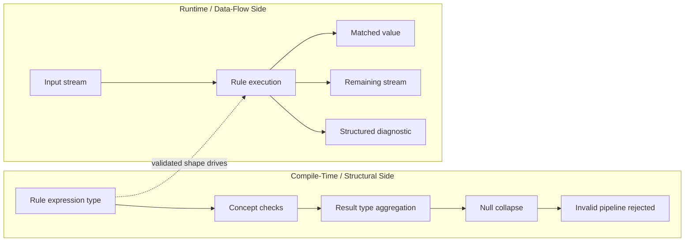
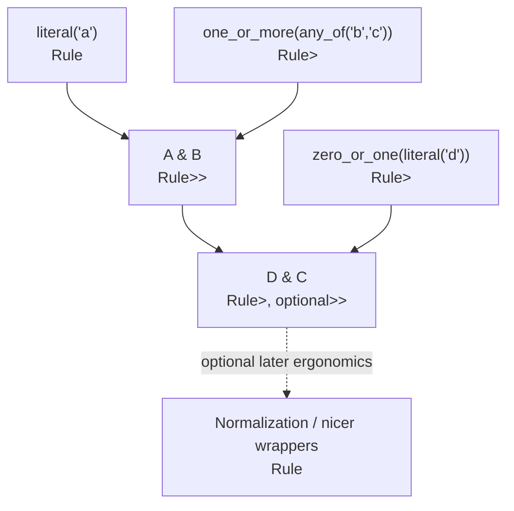
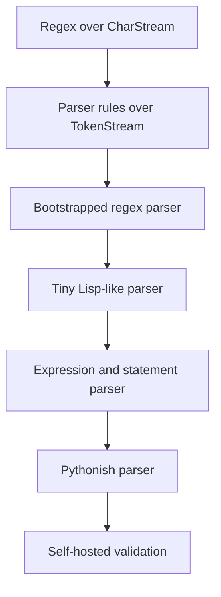

# Rule Lab Design Doc

Status: promoted to `~/projects/rule_lab` and completed as a v1 research
proof. This file is retained as the origin design. The completed project docs,
close-out assessment, and retrospective now live in the project repo.

Key retrospective lesson: Rule Lab succeeded by preserving the Pysh-style rule
composition idea while making each layer produce a verified artifact. A v2
should start with the final tiny-language pressure test earlier and work
backward from concrete pain, rather than climbing through historical layers
again.

## Core Question

Can a Pysh-style abstract rule system become safer, clearer, and more
inspectable when rebuilt around C++23 concepts, explicit failure values, and
compile-time result typing?

Rule Lab starts deliberately abstract:

```text
Rule<Input> -> Output
```

The project earns each later idea one layer at a time: failure, streams,
consumption, typed composition, character processing, regex rules, token-stream
parsing, bootstrapped regex parsing, and eventually language parsing.

The goal is not to port Pysh to C++. The goal is to preserve Pysh's satisfying
rule-composition idea while replacing Python runtime typing, exception-based
control flow, and loose result aggregation with explicit C++23 language
features.

## Name

`rule_lab` is descriptive by design.

This is an educational and experimental project, not a named creative product.
The name keeps the focus on the abstract object being studied: a typed rule.

## Fantasy

I build a tiny pyramid of typed rule abstractions.

At the bottom, a rule is just a pure transformation from one typed value to
another typed value. Each new layer adds one necessary idea: explicit failure,
streams, consumption, composition, aggregation, and character processing.

At the top of the first buildable unit, I can define a compact regex-like
expression out of stream rules:

```text
literal('a') & one_or_more(any_of("bc")) & zero_or_one(literal('d'))
```

The type of that expression is known at compile time. The success value has a
structured representation that mirrors the expression. Failures are explicit
values, not exceptions. Tests can inspect the matched value, the remaining
stream, and the diagnostic path.

The sharper proof is syntax consumption without semantic pollution:

```cpp
auto range_rule =
    discard(literal('[')) &
    alpha() &
    discard(literal('-')) &
    alpha() &
    discard(literal(']'));

static_assert(std::same_as<
    RuleResult<decltype(range_rule)>,
    Sequence<char, char>
>);
```

That example is the core promise: punctuation can be validated and consumed
while the compile-time result type keeps only the semantic values.

## Fundamental Object

`Rule`.

A rule is a typed, deterministic transformation. Every later object exists to
make rules more expressive without losing their type-level shape.

Core objects:

- `Rule`: concept-level contract for invoking a rule.
- `RuleInput`: type trait or alias that exposes a rule's accepted input type.
- `RuleResult`: type trait or alias that exposes a rule's success type.
- `Null`: no-value success marker.
- `Error`: structured diagnostic value.
- `Expected<T>`: optional alias around `std::expected<T, Error>`.
- `Stream<T>`: typed input sequence with explicit `head` and `tail` failure.
- `StreamResult<T, U>`: matched value plus remaining stream.
- `Sequence<A, B>`: conjunction result shape.
- `Choice<A, B>`: disjunction result shape.
- `RuleShape`: optional structural representation of a rule expression if C++
  types alone are not enough for diagnostics.

Domain objects earned later:

- `CharStream`: string-backed stream of `char`.
- `Regex`: facade or namespace for character-oriented helpers.
- `Token`: typed lexical unit for parser milestones.
- `TokenStream`: stream over tokens rather than characters.
- `ParserRule`: token-stream rule that produces typed parse products.
- `RegexAst`: optional parsed regex syntax artifact.
- `RegexParser`: bootstrapped parser that parses regex syntax into regex rule
  structure.

## Layered Model

The project should climb from pure abstraction to concrete regex behavior in a
small number of visible layers.

```mermaid
flowchart TD
    A["Rule<Input> -> Output"]
    B["FailableRule<Input> -> expected<Output, Error>"]
    C["Stream<T><br/>head() and tail() return expected values"]
    D["StreamRule<Stream<T>> -> expected<StreamResult<T, Output>, Error>"]
    E["Typed composition<br/>and / or / repetition / Null collapse"]
    F["CharStream"]
    G["Regex rules over characters"]
    H["TokenStream parser rules"]
    I["Bootstrapped regex parser"]
    J["Language parsers"]
    K["Self-hosted validation"]

    A --> B --> C --> D --> E --> F --> G --> H --> I --> J --> K
```



The first buildable unit ends at regex rules over `CharStream`. The next early
milestones are token-stream parser rules and a bootstrapped regex parser.
Language parsers and self-hosted validation are later pressure tests.

## Two-Way Representation

Rule Lab should have a two-way representation in the same spirit as IRATA.

In IRATA, the processor had a structural representation that was validated
during construction, and a runtime representation that applied that validated
structure as the machine executed.

Rule Lab should do the same for rule pipelines:

- compile-time structure tracks rule input, output, composition, and collapse
  rules,
- compile-time validation rejects ill-typed rule graphs before data flows,
- runtime values preserve the structure of what matched,
- runtime diagnostics preserve the structure of what failed,
- runtime execution applies the validated structure to actual input streams.



The static type representation is not merely documentation. It is the
structural model of the rule pipeline. The runtime representation is the flow of
real data through that already-validated pipeline.

Concepts are the abstraction boundary. They should define what a rule, stream,
and stream rule must provide without forcing inheritance or universal base
objects. Concrete rules stay native typed values; generic combinators operate
over objects that satisfy the concepts.

## Type Composition

Composition changes the result type in a way the compiler can validate.

In these examples, `Rule<A>` is shorthand for "a rule whose success result type
is `A`." Input type compatibility is a separate axis and should be checked by
the relevant rule or stream-rule concept.

Examples:

```text
Rule<A> & Rule<B>       -> Rule<Sequence<A, B>>
Rule<A> | Rule<B>       -> Rule<Choice<A, B>>
Rule<A> & Rule<Null>    -> Rule<A>
Rule<Null> & Rule<A>    -> Rule<A>
Rule<Null> & Rule<Null> -> Rule<Null>
zero_or_more(Rule<A>)   -> Rule<vector<A>>
zero_or_one(Rule<A>)    -> Rule<optional<A>>
```

The exact C++ names can change, but the property should not: the type of a rule
expression should communicate the shape of its result without runtime schema
inspection.

The project should investigate whether `std::tuple`, `std::variant`,
`std::optional`, and custom named wrappers are enough, or whether domain-specific
`Sequence` and `Choice` wrappers make diagnostics, tests, and documentation
clearer.



## Progress Validation

Repetition needs a narrow compile-time validation pass.

Rule Lab should not try to prove that arbitrary rules terminate. It only needs
to reject structurally obvious no-progress loops, such as repeating a rule that
can succeed without consuming input.

A useful model is a small progress trait:

```text
always_consumes
may_consume
never_consumes
unknown
```

Then `zero_or_more(rule)` and `one_or_more(rule)` can reject child rules that are
known to be `never_consumes`, and can require a runtime progress guard for child
rules whose consumption depends on input. This is similar in spirit to a
microcode compiler validating the shape of the program before execution: it
catches invalid structure without pretending to solve every possible runtime
behavior.

## Why This Fits

This project directly revisits the Pysh lesson:

- Pysh had an elegant rule algebra.
- Pysh relied on Python runtime typing, abstract base classes, and exceptions
  for normal parser control flow.
- Pysh became risky when too many layers stayed live at once.

Rule Lab keeps the good part and changes the discipline:

- use C++23 concepts to define rule capabilities,
- use `std::expected` for failure,
- use ordinary values for parse state and diagnostics,
- make result aggregation explicit in the type system,
- test every layer before adding the next,
- keep the first concrete unit bounded to character-stream regex rules.

It also continues the `game_ai_lab` pattern: generic behavior should be expressed
through small concepts over strongly typed native objects, and abstractions must
prove themselves through a concrete use.

## Non-Goals

V1 excludes:

- a full parser generator,
- a programming language,
- a full POSIX or PCRE-compatible regex engine,
- exceptions for ordinary rule failure,
- stringly typed result schemas,
- runtime `any` as the main type escape hatch,
- a macro DSL before ordinary C++ APIs prove inadequate,
- regex performance work before the type model is clear,
- a generic AST.

The first unit should stay focused on the typed rule pyramid and one concrete
character-stream application. The next early milestone is a parser layer over
token streams, not a full language or parser generator.

## V1 Thesis

The smallest worthwhile v1 is a C++23 rule algebra that can express and test a
small regex-like matcher over a character stream.

V1 should support:

- pure `Rule<Input, Output>` concepts,
- explicit failable rules using `std::expected`,
- `Stream<T>` with `head()` and `tail()` returning expected values,
- stream rules that return both a typed result and the remaining stream,
- `Null` results that collapse out of conjunctions,
- conjunction with compile-time aggregate result typing,
- disjunction with compile-time choice result typing,
- `literal`,
- `any`,
- `one_or_more`,
- `zero_or_more`,
- `zero_or_one`,
- `CharStream` over string input,
- regex-style rules built directly from stream combinators,
- structured diagnostics and tests for both success and failure.

The next early milestones after v1 are:

- a token-stream parser layer built from the same abstract rule ideas,
- a bootstrapping regex parser that parses regex syntax into executable regex
  rules.

## First Runnable Moment

The first delightful runnable moment is a typed regex-style match:

```text
input:
  "abbcd!"

rule:
  literal('a') & one_or_more(any_of("bc")) & zero_or_one(literal('d'))

result:
  matched:
    'a'
    ['b', 'b', 'c']
    'd'
  remaining:
    "!"
```

The proof is not only that the match succeeds. The proof is that:

- the expression's result type is determined at compile time,
- the expression's rule pipeline has already been structurally validated,
- no exception is thrown for a normal mismatch,
- the remaining stream is inspectable,
- an invalid input produces a structured error,
- the same primitive combinators are tested below the regex layer.

## Phase Plan

### Phase 1: Rule And Expected

Deliverable:

- compile-time rule concept,
- simple pure rules,
- failable rule shape using `std::expected`,
- `Null` result marker.

Verification:

- tests prove successful invocation,
- tests prove explicit failure values,
- compile-time assertions prove expected result types.

Checkpoint:

- Is the root `Rule<T> -> U` idea clearer in C++ than in Python?

### Phase 2: Stream

Deliverable:

- `Stream<T>` concept,
- concrete small stream implementation for tests,
- `head()` and `tail()` returning expected values,
- position or exhaustion diagnostics.

Verification:

- tests for non-empty streams, empty streams, tail behavior, and deterministic
  state.

Checkpoint:

- Does the stream abstraction expose enough state for later diagnostics without
  becoming a parser framework?

### Phase 3: Stream Rules

Deliverable:

- stream rule concept,
- result-plus-remaining-stream carrier,
- `literal` and `any`.

Verification:

- tests assert matched value and remaining stream,
- failure leaves the original stream inspectable,
- no exceptions are used for mismatch.

Checkpoint:

- Is consumption visible enough to make tests pleasant?

### Phase 4: Typed Composition

Deliverable:

- `and`,
- `or`,
- `one_or_more`,
- `zero_or_more`,
- `zero_or_one`,
- compile-time result aggregation and `Null` collapse.

Verification:

- type assertions for conjunction, disjunction, option, and repetition,
- behavior tests for success, failure, backtracking, and empty matches,
- diagnostics for aggregate failures.

Invariant:

- repetition combinators must detect a successful child rule that does not
  consume input and return a structured error rather than looping.

Checkpoint:

- Do the result types help explain the rule, or are they becoming template noise?

### Phase 5: CharStream Regex

Deliverable:

- string-backed `CharStream`,
- character helpers such as `char_literal`, `any_char`, and `any_of`,
- regex-style examples built directly from stream rules.

Verification:

- tests for complete match, prefix match, failed match, optional match, and
  repeated match,
- golden examples for result values and remaining input.

Checkpoint:

- Is this enough concrete pressure to justify the abstract pyramid?

### Phase 6: TokenStream Parser Rules

Deliverable:

- typed `Token`,
- `TokenStream`,
- parser-oriented stream rules over tokens,
- typed parse products using the same conjunction, disjunction, repetition, and
  `Null` collapse principles.

Verification:

- tests for token consumption and remaining token stream,
- compile-time assertions for parser result types,
- diagnostics for expected-token and unexpected-end failures.

Checkpoint:

- Does the same rule algebra work cleanly when the stream item is a token rather
  than a character?

### Phase 7: Bootstrapped Regex Parser

Deliverable:

- a small regex syntax,
- tokenizer for that syntax,
- parser rules that parse regex tokens,
- construction of executable regex rules from the parsed syntax,
- optional `RegexAst` if it makes the bootstrap easier to inspect.

Verification:

- tests prove parsed regexes behave the same as equivalent hand-built regex
  rules,
- tests cover invalid regex syntax with structured diagnostics,
- examples show source regex text, tokens, parsed structure, built rule, match
  result, and remaining input.

Checkpoint:

- Has Rule Lab crossed from hand-built combinators into a self-hosting parser
  layer without losing compile-time structure or runtime traceability?

## Later Growth Path

Later milestones should wait until the regex and token-parser layers teach
concrete lessons about the typed rule algebra.

The natural long-term path is similar to Pysh, but with stricter phase
boundaries:



Language-parser milestones should produce artifacts rather than just accept or
reject text:

- tokens,
- parse tree or grammar-shaped structure,
- typed AST where appropriate,
- structured diagnostics,
- trace of rule execution,
- compile-time assertions for parser result types.

The self-hosted validation idea is conceptually tidy but should be late. The
system first needs enough expressive power to parse and validate interesting
rule definitions. A useful version might include:

- regex syntax parsed by Rule Lab and tested against hand-built equivalents,
- grammar fragments parsed by Rule Lab and used to build parser rules,
- golden self-validation fixtures that prove parsed rule definitions produce the
  same behavior as native C++ rule definitions,
- diagnostics that compare compile-time rule shape with runtime execution
  traces.

The trigger for this path should be evidence from earlier milestones, not the
abstract desire to make the rule system universal.

## Language Engine Interface

If Rule Lab grows into language parsing, it would be fun for it to expose an
elegant way to define a language's parsing engine.

There are two attractive directions:

- an in-C++ symbolic interface where rules are first-class objects and compose
  through operators, similar in spirit to Boost.Spirit,
- a secondary grammar DSL where rules are written as grammar declarations,
  parsed by Rule Lab itself, and paired with semantic actions where needed,
  similar in spirit to yacc.

The in-C++ path keeps type information close to the compiler:

```text
auto expr = term >> zero_or_more((literal("+") | literal("-")) >> term);
```

An even more ambitious version would let language object types attach their
parsing rules at compile time. In that model, Rule Lab is not only a parser
implementation detail. It is a library interface that another language framework
can satisfy or consume.

For example, a Pythonish language might define an integer object and attach its
parser through a static method, CRTP base, concept specialization, type trait, or
template parameter:

```cpp
struct Int {
    int value;

    static constexpr auto parser =
        rule_lab::regex("\\d+")
            .transform([](std::string_view text) {
                return Int{parse_int(text)};
            });
};

static_assert(rule_lab::Parsable<Int>);
```

The exact C++ mechanism should be earned later. Possible shapes include:

- `T::parser`,
- `rule_lab::parser_for<T>`,
- CRTP such as `Parsable<T, Parser>`,
- concept-map-like traits,
- generated parser attachments from a grammar DSL.

The design goal is that a language definition can live in its own typed object
model while Rule Lab supplies the parsing and validation interface. The regex
and parser systems built inside Rule Lab would be the first bootstrap clients of
that interface, not separate special cases.

The grammar-DSL path is more self-hosting and inspectable:

```text
expr  := term (("+" | "-") term)* ;
term  := factor (("*" | "/") factor)* ;
factor := number | "(" expr ")" ;
```

The hard design question is semantic construction. A parser can recognize a
language with grammar rules, but a useful parsing engine must also build the
needed artifacts: parse tree, AST, typed AST, diagnostics, symbol references, or
other language-specific products.

Possible approaches:

- C++ semantic action callbacks attached to symbolic rules,
- typed builder functions attached to grammar DSL productions,
- generated C++ from parsed grammar definitions,
- a deliberately small action language parsed by Rule Lab,
- a two-stage model where the grammar DSL builds a parse tree first and native
  C++ transforms that tree afterward.

This should be a later milestone. The first job is to make hand-built rules,
regex bootstrap, and token-stream parser rules solid enough that the interface
question has real examples behind it.

## C++23 Learning Goals

This project should explicitly learn modern C++ as part of the work.

Likely topics:

- concepts and `requires` expressions,
- `std::expected`,
- class template argument deduction,
- constrained function templates,
- `std::invoke_result_t` and type traits,
- `std::tuple`, `std::variant`, and `std::optional`,
- `constexpr` and `static_assert` for type-level tests,
- value categories and move behavior in composable rule objects,
- ranges where they clarify stream or repetition behavior,
- `std::source_location` if it helps diagnostics without adding clutter.

The learning goal should stay practical: use C++23 features where they make the
rule model more explicit, not as a checklist.

## Testing Principle

Tests are part of the design, not follow-up work.

Every layer should have:

- behavior tests through public APIs,
- compile-time type assertions,
- failure-path tests,
- diagnostic tests,
- coverage expectations inherited from `game_ai_lab`.

Rule Lab should also invest early in substantial test scaffolding. The project
will verify large structured values: nested result shapes, remaining streams,
diagnostic trees, parsed rule structures, and later AST-like artifacts. Raw
GoogleTest assertions against those objects will become noisy quickly.

Useful test helpers might include:

- stream builders and remaining-stream matchers,
- success and failure matchers for `std::expected`,
- rule-result matchers that display nested `Sequence` and `Choice` values
  clearly,
- diagnostic matchers for expected rule names, positions, and child failures,
- type assertion helpers for `RuleInput`, `RuleResult`, and progress traits,
- golden structure helpers for parsed regexes and later parser artifacts.

The test scaffolding should make examples read like small specifications:

```text
expect_match(rule, "a-b!")
  .with_value(sequence('a', 'b'))
  .with_remaining("!");
```

Readable tests are part of the design pressure. If a behavior is hard to assert
cleanly, the public artifact may not be shaped well enough yet.

The project should use the same general C++ discipline as `game_ai_lab`:

- CMake,
- GoogleTest,
- clean warnings,
- formatting,
- static analysis when practical,
- coverage command,
- `make all` or equivalent presubmit command.

## First Questions

- What is the smallest C++23 concept that usefully defines a rule?
- Should rule output type be discovered with `std::invoke_result_t`, an explicit
  nested type, or a customization trait?
- Is `std::expected` sufficient for all failable layers, or does the project
  need a local alias to keep signatures readable?
- Should `Stream<T>` be a concept over value types, a concrete persistent object,
  or both?
- How should a stream represent position without making every tail copy
  expensive?
- What result representation produces readable tests: `std::tuple`, named
  `Sequence`, or a normalized aggregate type?
- How should `Null` collapse in type composition?
- How should `Or` preserve branch identity: `std::variant`, custom `Choice`, or a
  richer typed wrapper?
- Can repetition avoid infinite loops when a child rule succeeds without
  consuming input?
- What diagnostics are useful without turning v1 into a parser framework?
- Is the rule expression's C++ type enough structural representation, or does the
  system need an explicit `RuleShape` object as well?
- What validations belong at compile time, and what validations can only happen
  when a stream is flowing through the rule?
- Where is the boundary between a character-stream regex matcher and a
  token-stream parser that can build regex matchers?
- Does the bootstrapped regex parser need a `RegexAst`, or can it construct
  typed regex rules directly while still staying inspectable?
- Should language grammars eventually be defined through C++ symbolic rules, a
  bootstrapped grammar DSL, or both?
- What is the least magical way to attach semantic construction logic to parsed
  grammar rules?
- Can language object types attach their own parse rules through static methods,
  traits, CRTP, or template parameters while still keeping Rule Lab's public
  interface small?
- Are Rule Lab's own regex and parser systems good bootstrap clients of that
  attached-rule interface?
