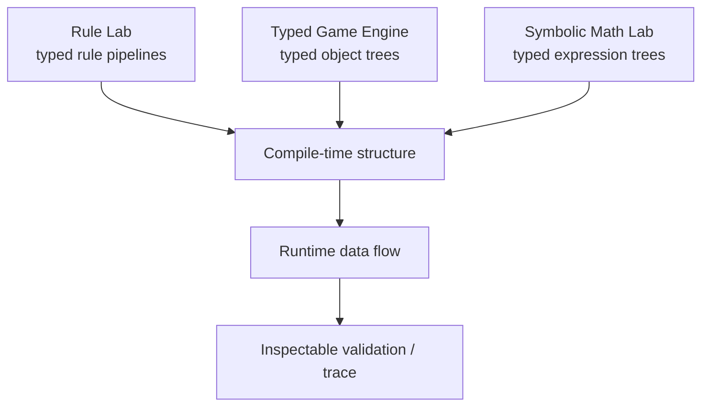
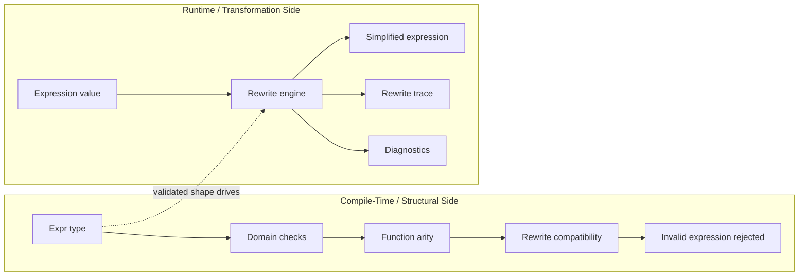
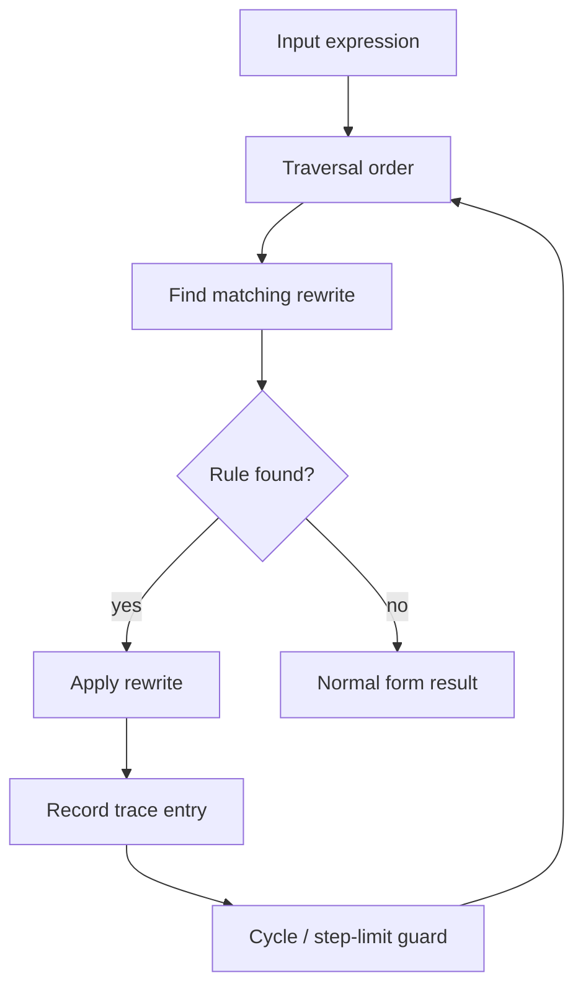

# Symbolic Math Lab Design Doc

## Core Question

Can a SymPy-like symbolic math system be rebuilt in C++23 around typed
expression trees, explicit rewrite rules, compile-time structure validation, and
inspectable algebraic transformations?

The rough shorthand is:

```text
SymPy in C++23 clothes
```

The goal is not to clone all of SymPy. The goal is to study the heart of a
symbolic algebra system with modern C++ discipline:

- symbolic expressions are explicit typed structures,
- algebraic rewrites are rule objects with preconditions and explanations,
- simplification is deterministic and inspectable,
- invalid expression construction is rejected where possible,
- runtime transformation history can be tested and explained.

## Working Name

`symbolic_math_lab` is descriptive by design.

The important object is not a calculator UI or a notebook. The important object
is a symbolic expression that can be built, typed, rewritten, evaluated, and
explained.

## Fantasy

I can write a mathematical expression in C++:

```cpp
auto x = sym::variable<"x">();
auto expr = (x + 0) * 1 + sin(0);
```

The system can show:

```text
input:      ((x + 0) * 1) + sin(0)
rewrite 1: (x * 1) + sin(0)       because a + 0 -> a
rewrite 2: x + sin(0)             because a * 1 -> a
rewrite 3: x + 0                  because sin(0) -> 0
rewrite 4: x                      because a + 0 -> a
result:     x
```

The expression has a structural representation that tests can inspect. The
rewrite sequence is not a black box. Algebraic rules are named, typed, and
explain why they fired.

The first delightful moment is not plotting or solving calculus. It is watching
a tiny expression simplify through a deterministic proof trace.

## Fundamental Object

`Expr`.

An expression is a typed symbolic structure. Every later layer exists to make
expression construction, transformation, and interpretation safer and more
inspectable.

Candidate core objects:

- `Expr`: concept-level contract for symbolic expressions,
- `Symbol<Name>`: named symbolic variable,
- `Constant<T>`: exact or numeric value,
- `Add<A, B>`, `Mul<A, B>`, `Pow<A, B>`: structural expression nodes,
- `Function<Tag, Args...>`: named symbolic function application,
- `RewriteRule`: typed transformation with a name and precondition,
- `RewriteResult`: transformed expression plus explanation,
- `Trace`: ordered list of rewrite applications,
- `Domain`: numeric or algebraic domain metadata,
- `Assumptions`: facts such as real, integer, positive, nonzero,
- `NormalForm`: canonicalized expression shape.

The central design question is whether expression node types should preserve
the full syntactic tree, normalize eagerly into canonical forms, or support both
views.

## Third Leg Of The Stool

This sits beside Rule Lab and Typed Game Engine as a third version of the same
idea.



The common pattern is:

```text
static structure validates shape
runtime representation flows data through that shape
tests inspect the result and the path taken
```

Rule Lab validates rule composition. Typed Game Engine validates property,
behavior, and message composition. Symbolic Math Lab validates expression and
rewrite composition.

## Two-Way Representation

Symbolic Math Lab should also have a two-way representation.

The static side knows expression node types, function arity, operator result
domains, and rewrite rule input/output compatibility. The runtime side carries
values, expression trees, rewrite traces, diagnostics, and evaluation contexts.



The compile-time layer should be used where it makes the model clearer:

- function arity,
- expression category,
- valid child types,
- known domains,
- obvious invalid operations,
- rewrite rule compatibility.

It should not pretend to solve arbitrary mathematical equivalence at compile
time.

## Expression Construction

The ergonomic target is a symbolic C++ interface:

```cpp
auto x = sym::variable<"x">();
auto y = sym::variable<"y">();

auto expr = expand((x + y) * (x - y));
```

Possible construction paths:

- direct C++ operator overloading,
- named constructors such as `sym::add(a, b)`,
- expression templates,
- fixed-string variable tags,
- a later text parser built with Rule Lab.

The C++ surface should be pleasant, but the internal representation should stay
inspectable. If overloaded operators hide the tree shape too aggressively, the
project loses its main proof artifact.

## Rewrites

A rewrite rule should be a first-class object:

```text
rule: add_zero_right
pattern: Add<A, 0>
result: A
precondition: none
```

or:

```text
rule: cancel_fraction
pattern: (A * B) / B
result: A
precondition: B != 0
```

Rules need names, applicability checks, result construction, and explanations.
Some rules are unconditional identities. Others require assumptions. V1 should
start with unconditional arithmetic identities before introducing assumption
tracking.

## Simplification Pipeline

V1 should not attempt global optimal simplification.

It should define a small deterministic strategy:

- traverse expression tree in a documented order,
- apply the first matching rule from an ordered rule set,
- record the rewrite,
- repeat until no rule applies or a hard step limit is reached,
- detect repeated states to avoid trivial rewrite cycles.



This is a place to be honest about limits. Simplification can become a search
problem quickly. The first buildable unit should prove local rewrites and trace
quality, not canonicalize all algebra.

## Domains And Assumptions

The project should eventually model mathematical domains explicitly:

- integers,
- rationals,
- reals,
- complex numbers,
- booleans and predicates,
- matrices or vectors later.

Assumptions matter because some rewrites are not universally valid:

```text
sqrt(x * x) -> x        valid if x >= 0
x / x -> 1              valid if x != 0
log(a * b) -> log(a)+log(b) has domain constraints
```

V1 should mostly avoid assumption-heavy identities. It can include the concept
early, but use it sparingly.

## Relationship To Rule Lab

Rule Lab could eventually parse expression text into symbolic expression trees:

```text
"(x + y) * (x - y)" -> Mul<Add<x, y>, Sub<x, y>>
```

That creates a clean bootstrap path:

- Symbolic Math Lab starts with hand-built C++ expressions,
- Rule Lab later parses a small expression grammar,
- parsed expressions are checked against hand-built equivalents,
- rewrite traces provide semantic validation for the parser output.

This is a useful separation. Symbolic Math Lab should not need a parser to
exist. Rule Lab can become a client later.

## Non-Goals

V1 should not include:

- a full CAS,
- arbitrary equation solving,
- calculus,
- matrices,
- plotting,
- numerical optimization,
- theorem proving,
- SMT solving,
- arbitrary precision arithmetic unless it is needed for exact constants,
- a notebook or REPL,
- a broad parser before hand-built expressions work.

The first version should avoid the trap of becoming "all of math." It should be
a small expression and rewrite laboratory.

## V1 Thesis

The smallest worthwhile V1 is a deterministic simplifier for a tiny arithmetic
expression language.

V1 should support:

- symbols,
- integer constants,
- addition,
- multiplication,
- unary negation or subtraction if useful,
- structural equality,
- pretty-printing,
- a small ordered rewrite set,
- deterministic simplification,
- rewrite traces,
- tests for expression shape and traces.

Starter rewrite rules:

- `a + 0 -> a`,
- `0 + a -> a`,
- `a * 1 -> a`,
- `1 * a -> a`,
- `a * 0 -> 0`,
- `0 * a -> 0`,
- constant folding for integer literals,
- optional flattening for nested addition and multiplication.

The first runnable moment:

```text
input:  ((x + 0) * 1) + (2 * 3)
trace:
  add_zero_right: x + 0 -> x
  mul_one_right: x * 1 -> x
  const_mul: 2 * 3 -> 6
result: x + 6
```

## Test Scaffolding

This project will need substantial test helpers from the start.

Useful helpers:

- expression builders for concise test setup,
- structural matchers such as `is_add(symbol("x"), constant(6))`,
- trace matchers such as `used_rule("add_zero_right")`,
- pretty-print golden assertions,
- compile-time type assertions for expression node types,
- simplification fixtures with step limits,
- diagnostics helpers for failed assumptions or invalid rewrites.

Tests should not compare only printed strings. Printed strings are useful, but
the expression tree and rewrite trace are the real artifacts.

## First Questions

- Should `Expr` be a concept, a variant-backed runtime value, or both?
- How much expression structure should live in the C++ type versus runtime node
  values?
- Should simplification preserve syntactic structure or eagerly normalize?
- Are custom expression node wrappers better than `std::tuple`-style storage?
- How should fixed-string symbol names be represented in C++23?
- Should constants be exact integers/rationals from the start?
- How are rewrite patterns represented without building a second language too
  early?
- Can rewrite diagnostics be useful without becoming proof objects?
- Where is the boundary between simplification and theorem proving?
- What tiny expression set gives the best first proof?

## Fit Assessment

| Goal | Fit | Notes |
| --- | --- | --- |
| Small deterministic world | Strong | A tiny expression language plus deterministic rewrite order is a compact world. |
| One fundamental object | Strong | `Expr` organizes the whole project. |
| Inspectable state | Strong | Expression trees and rewrite traces are naturally inspectable. |
| Tests as proof | Strong | Structural assertions and trace assertions can prove behavior directly. |
| Avoid generic-engine trap | Medium | The risk is CAS sprawl rather than engine sprawl. V1 must stay tiny. |
| C++23 learning value | Strong | Concepts, expression templates, NTTP tags, constexpr checks, and variants all fit. |

This is a strong sibling to Rule Lab and Typed Game Engine. The constraint is
scope: build the smallest symbolic rewrite machine that can explain itself
before reaching for broader algebra.
