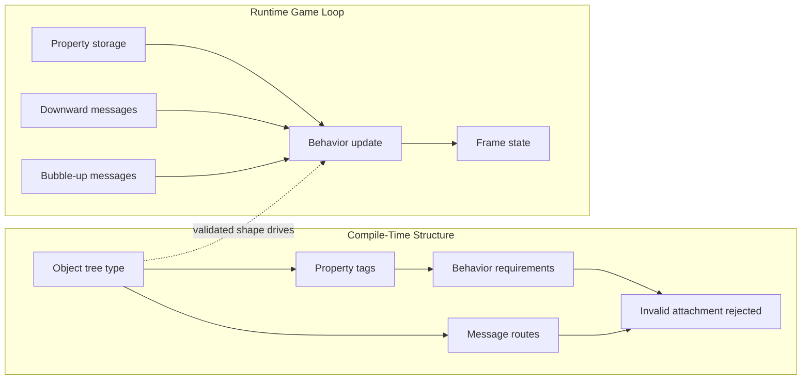
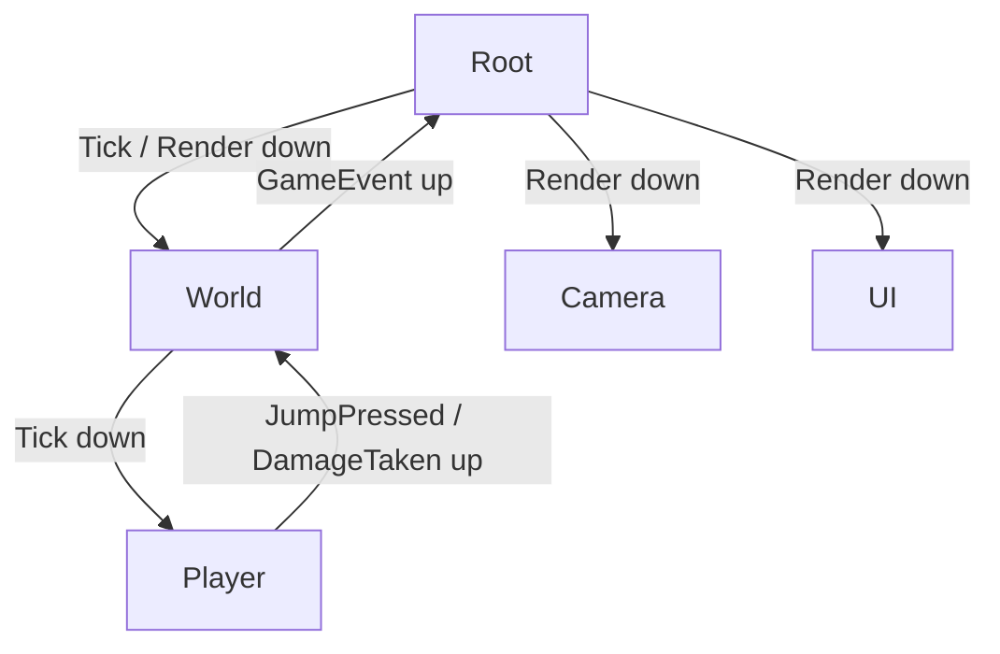

# Typed Game Engine Design Doc

## Core Question

Can a game object system be expressed as a statically validated C++23 type
graph, where objects declare typed properties, behaviors declare their property
requirements, and message plumbing is checked before runtime?

The attractive version is not "a generic game engine" in the usual framework
sense. The attractive version is a compile-time object model:

- objects are composable nodes in a tree,
- properties are typed data attached to objects,
- behaviors are small bits of code attached to objects,
- behaviors declare the properties and messages they require,
- object trees publish, route, and bubble typed messages,
- the compiler rejects invalid structure before the game loop runs.

At runtime, the engine should mostly run game code. It should not repeatedly
rediscover whether objects have the properties or handlers that the static
model already proved.

## Working Name

`typed_game_engine` is only a descriptive shelf name.

This idea probably needs a better name if it becomes a real project. The
important point for now is the object being studied: a game object tree whose
structure, properties, behaviors, and message paths are represented in the C++
type system.

## Fantasy

I define a tiny game world out of native C++ types.

An object can have properties:

```cpp
using Player = game::object<
    game::property<Position, Vec2>,
    game::property<Velocity, Vec2>,
    game::property<Sprite, SpriteMesh>,
    game::behavior<PhysicsBody>,
    game::behavior<SpriteRenderer>
>;
```

`PhysicsBody` declares that it requires `Position` and `Velocity`.
`SpriteRenderer` declares that it requires `Position` and `Sprite`.

If I attach `PhysicsBody` to an object without `Position`, the program fails to
compile with a useful diagnostic. If I wire a child to receive `Tick` messages
but no child accepts them, that is either rejected or explicitly represented as
an unused message path. If an input object bubbles up `JumpPressed`, the parent
tree can only handle it through a typed route.

The runtime loop becomes simple:

```text
root.publish_down(Tick{dt});
root.publish_down(Render{frame});
root.bubble_up(UserAction{...});
```

The interesting part is that the compiler understands the object shape and the
message plumbing before a frame is rendered.

## Fundamental Object

`GameObject`.

A game object is not a base class. It is a typed structural value made from:

- a compile-time object identity or tag,
- a typed property set,
- a typed behavior set,
- a typed child set,
- a typed message interface.

Candidate core objects:

- `Object<Tag, Properties, Behaviors, Children>`: structural object node,
- `Property<Tag, T>`: named typed data,
- `Behavior<T>`: code unit with declared requirements and handlers,
- `Requires<...>`: property or capability requirements for a behavior,
- `Message<Tag, Payload>`: typed event or command,
- `Route<Message, Direction>`: static description of message flow,
- `ObjectPath<...>`: compile-time path through the object tree,
- `ObjectShape`: optional structural representation for diagnostics.

The key design choice is that "has a position" should be a type-level fact,
not a runtime string lookup.

## Static And Runtime Sides

This has the same two-way representation instinct as Rule Lab and IRATA:

- the static side represents the object tree, property sets, behavior
  requirements, and message routes,
- the runtime side stores concrete property values and invokes already-checked
  behavior code.



The design is only valuable if the static side removes real runtime ambiguity.
If the runtime system still needs dynamic probing, dynamic casts, string-keyed
properties, or broad handler maps for normal operation, the type model has not
earned its complexity.

## Property And Behavior Validation

The central proof is behavior attachment.

```cpp
struct PhysicsBody {
    using requires_properties = game::requires<Position, Velocity>;

    static void on(game::Tick tick, auto& self) {
        self.get<Position>() += self.get<Velocity>() * tick.dt;
    }
};
```

Attaching `PhysicsBody` to an object should instantiate a validation path like:

```text
Behavior<PhysicsBody> attached to Object<...>
requires Position: found Vec2
requires Velocity: found Vec2
result: valid
```

A failing object should fail early:

```text
PhysicsBody requires Velocity, but Object<PlayerTag> has no Velocity property.
```

C++23 concepts are the natural abstraction boundary:

- `PropertySet` defines tag lookup and type retrieval,
- `BehaviorFor<Object>` checks requirements against one object shape,
- `MessageHandler<Message, Object>` checks handler compatibility,
- `ObjectTree` checks child composition and object paths,
- `Routable<Message, Tree>` checks whether a message path is valid.

The goal is not inheritance. The goal is native C++ types constrained by
concepts, traits, and `static_assert` diagnostics.

## Message Passing

The object tree should support two main message directions:

- downward publish/push messages, such as `Tick`, `Render`, or `CollisionPass`,
- upward bubble messages, such as input actions, local state changes, or child
  requests.



The static model should know which objects can receive or emit which messages.
V1 should not try to solve arbitrary event buses. It should prove a small,
typed tree with a small fixed message vocabulary.

## Compile-Time Naming

The design needs names that exist in the type system.

Likely options:

- empty tag structs, such as `struct Position;`,
- fixed-string non-type template parameters where compiler support is pleasant,
- enum-class tags for small closed vocabularies,
- generated tag types if a later DSL exists.

The SICP-style idea is useful here: message tags act like object member
indicators, and dispatch follows those tags. The C++ version should make tags
types rather than runtime symbols wherever possible.

## Why This Might Work

The idea is plausible in a constrained form.

C++23 can represent many of the needed facts:

- concepts can express behavior and object requirements,
- `requires` clauses can produce targeted validation points,
- variadic templates can represent property and child sets,
- `std::tuple` or custom storage can hold runtime property values,
- `std::variant` can represent closed message sets where needed,
- `constexpr` functions can validate structural metadata,
- static assertions can make invalid attachments fail at construction time.

The hard boundary is open-ended runtime dynamism. A fully dynamic editor-driven
scene graph cannot be completely validated at compile time because its shape is
not known at compile time. That does not make the project invalid. It just means
the first version should be a small, statically declared world.

## Why This Is Similar To Rule Lab

Rule Lab studies typed rule composition. This idea studies typed object
composition.

They share a pattern:

```text
static structure validates shape
runtime representation flows data through that shape
```

Rule Lab's compile-time rule graph validates parser result types. This project
would validate:

- property availability,
- behavior attachment,
- message handler compatibility,
- object tree paths,
- event direction and payload types.

Both projects are really about making an abstract machine visible to the C++
type system, then letting runtime execution follow the validated structure.

## Non-Goals

V1 should not be:

- a full production game engine,
- a level editor,
- a renderer,
- an ECS replacement,
- a physics engine,
- a scripting system,
- a plugin system,
- an arbitrary runtime scene graph,
- a universal event bus,
- a performance benchmark before the model exists.

The project fails if it starts by building an engine shell. It succeeds if one
tiny game-like object tree becomes statically inspectable and runs a few frames.

## V1 Thesis

The smallest useful V1 is a statically declared object tree with:

- one root object,
- two or three child objects,
- typed property sets,
- two behaviors with property requirements,
- one downward message,
- one upward message,
- compile-time rejection of an invalid behavior attachment,
- deterministic runtime trace of one or more frames.

The first runnable moment should be closer to this:

```text
Scene: root -> player, camera

Compile-time:
  Player has Position: yes
  Player has Velocity: yes
  PhysicsBody valid for Player: yes
  SpriteRenderer valid for Player: yes

Runtime frame 1:
  Tick(dt=0.016) delivered to Player
  PhysicsBody updated Position from (0, 0) to (1.6, 0)
  Render delivered to SpriteRenderer
  JumpPressed bubbled from Player to Root
```

That proves the important idea without needing assets, graphics, or a broad
engine architecture.

## Testing Principle

Tests should prove both compile-time structure and runtime flow.

Useful scaffolding:

- compile-fail tests for missing required properties,
- `static_assert` tests for valid object shapes,
- helper builders for tiny object trees,
- trace matchers for message delivery order,
- property matchers for before/after behavior effects,
- diagnostics tests for invalid attachment messages,
- deterministic frame logs.

The project should treat test helpers as part of the design. If the structure is
too hard to assert, the object representation is probably hiding the wrong
thing.

## First Questions

- Is the central object `GameObject`, `ObjectNode`, or something more precise?
- Are properties stored as a tagged tuple, custom heterogeneous map, or generated
  aggregate?
- How should duplicate property tags be rejected?
- Should behavior requirements be declared with nested aliases, concepts,
  free-function traits, or CRTP?
- Can C++ diagnostics be made readable enough for failed attachments?
- How much message routing should be static versus runtime?
- Are object names purely type-level tags, or do they also need runtime labels
  for diagnostics?
- Can child paths be represented ergonomically without turning the API into TMP
  machinery?
- Does this remain useful if only statically declared worlds are supported?
- What tiny concrete game-like scene would keep the project from becoming a
  generic engine first?

## Fit Assessment

| Goal | Fit | Notes |
| --- | --- | --- |
| Small deterministic world | Medium | Strong if V1 is one tiny static scene, weak if it begins as an engine. |
| One fundamental object | Strong | The object tree can organize the whole project. |
| Inspectable state | Strong | Property sets, behavior requirements, and message traces are naturally inspectable. |
| Tests as proof | Strong | Compile-time assertions and runtime traces can prove the model. |
| Avoid generic-engine trap | Weak to medium | This is the central risk and must be controlled by a tiny first scene. |
| C++23 learning value | Strong | Concepts, variadic templates, NTTPs, and constexpr validation are central. |

This should probably be parked as a research-lab project unless a concrete first
scene appears. The idea is valid, but the implementation needs a hard scope
constraint: prove one statically validated object tree before calling it an
engine.
